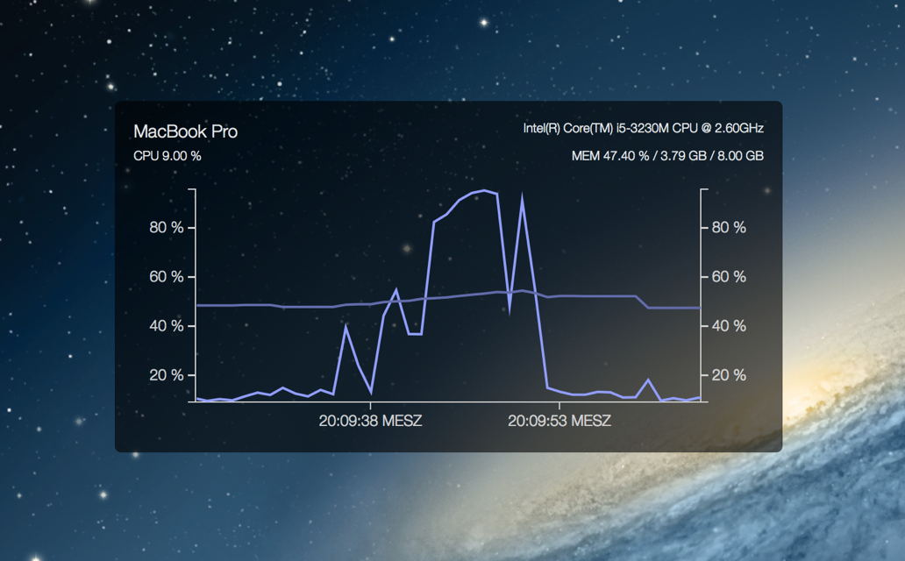

# uebersicht-sys-monitor

This widget shows system information about your mac in a real-time chart.

## Requirements

* Mac
* [Übersicht](http://tracesof.net/uebersicht/)

## Features

* System model
* Processor model
* Memory size
* CPU usage in percent
* MEM usage in percent / GB
* Light design
* Dark design

## Installation

Copy the downloaded and extracted `sys-monitor.widget` directory into your `Übersicht Widget` directory.

## Modify

* To switch between `light` and `dark`, change line `7`
* To delete a chart line, remove the `label object` and the `time object`

## Background

In every update interval, the program makes a snapshot of the usage of all processes in percent and calculates a sum for both, cpu and memory. For the displayed cpu usage, the sum of the process cpu usage must be divided through the number of logical cpu cores. The reason is: one process can have more than 100 percent of usage, but not more than the number of logical cpu cores multiplied by 100. All other values will be displayed without major calculation.

## Changelog

* 1.0.3
  * Max memory fix
* 1.0.2
  * Code / Readme Optimizations
* 1.0.1
  * Performance improved

## License

`uebersicht-sys-monitor` is available under the MIT license. Copyright (c) 2015 Kevin Porten
